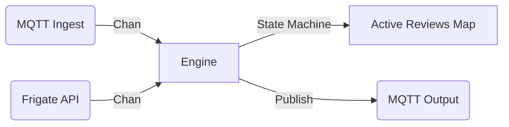

# Frigate Stitcher

Frigate Stitcher is a lightweight Go application designed to augment Frigate NVR by aggregating discrete Frigate events into "Custom Reviews" or "Incidents" based on user-defined profiles.

It listens to raw `frigate/events` over MQTT, matches them against configured profiles (camera + object combinations), and stitches them into a single "Review" entity. This Review stays active as long as activity continues, waiting for a configurable quiet period (gap) before closing.

## Features

*   **Smart Grouping**: Groups related events across multiple cameras into a single "Incident".
*   **Gap Logic**: Prevents fragmented alerts by keeping a review open during short pauses in activity.
*   **State Recovery**: Queries Frigate API on startup to sync active events.
*   **Ghost Event Detection**: Automatically cleans up events that Frigate fails to close (network blips).
*   **Standard Output**: Emits MQTT events (`frigate_stitcher/review`) following standard Frigate JSON patterns.

## Architecture

The application follows a **Pipeline Architecture** with a central, thread-safe Event Loop ("The Engine").



### Key Components

*   **`cmd/frigate-stitcher`**: Entry point. Handles config loading, signal trapping, and component wiring.
*   **`internal/engine`**: The core logic.
    *   **`Engine`**: Runs a single goroutine `Run()` loop that selects on incoming events and a 1-second `Ticker`.
    *   **`ReviewInstance`**: Represents an aggregated incident. Holds a map of `TrackedEvent`s.
    *   **`TrackedEvent`**: Wraps a standard Frigate event with a local `LastSeen` timestamp to detect stale data.
*   **`internal/mqtt`**: Wrapper for Paho MQTT client. Handles subscription and publishing.
*   **`internal/frigate`**: HTTP client for querying the Frigate API during startup.

## Logic Implementation

### 1. Ingestion
Events enter via MQTT or API polling. They are passed to the Engine's `IngestChan`.

### 2. Stitching (The Matcher)
When an event arrives:
1.  Iterate through all initialized **Profiles**.
2.  If `event.Camera` and `event.Label` match a profile:
    *   Check if an active **Review** exists for that profile.
    *   **New**: If no active review, create one.
    *   **Merge**: If review exists, add/update the event in the review's internal map.
3.  Publish a `new` or `update` message to MQTT.

### 3. Closing Logic (The Ticker)
Every second, the Engine checks all active reviews:

1.  **Ghost Check**: Iterate all underlying events. If an event is "active" (active in Frigate) but hasn't received an update in **300 seconds**, it is force-closed locally (EndTime set to now).
2.  **Gap Check**:
    *   Calculate `MaxEndTime` of all underlying events in the review.
    *   If active events exist (Frigate says they are ongoing) -> Keep Open.
    *   If ALL events are ended -> Calculate `Waited = Now - MaxEndTime`.
    *   If `Waited > Profile.Gap` -> **Close Review**.
        *   Publish `end` message.
        *   Remove from memory.

## Configuration

Configuration is loaded from `config.yaml`.

```yaml
mqtt:
  broker: "tcp://localhost:1883"
  topic: "frigate/events"

frigate:
  url: "http://localhost:5000"

profiles:
  - name: "front_yard"
    cameras: ["doorbell", "driveway"]
    objects: ["person", "car"]
    gap: 30 # Seconds to wait before closing
```

## Development

### Prerequisites
*   Go 1.25+
*   Access to an MQTT Broker and Frigate instance (for testing).

### Build

```bash
go build -o frigate-stitcher cmd/frigate-stitcher/main.go
```

### Run

```bash
./frigate-stitcher -config config.yaml
```

### Docker Build

```bash
docker build -t frigate-stitcher .
```
